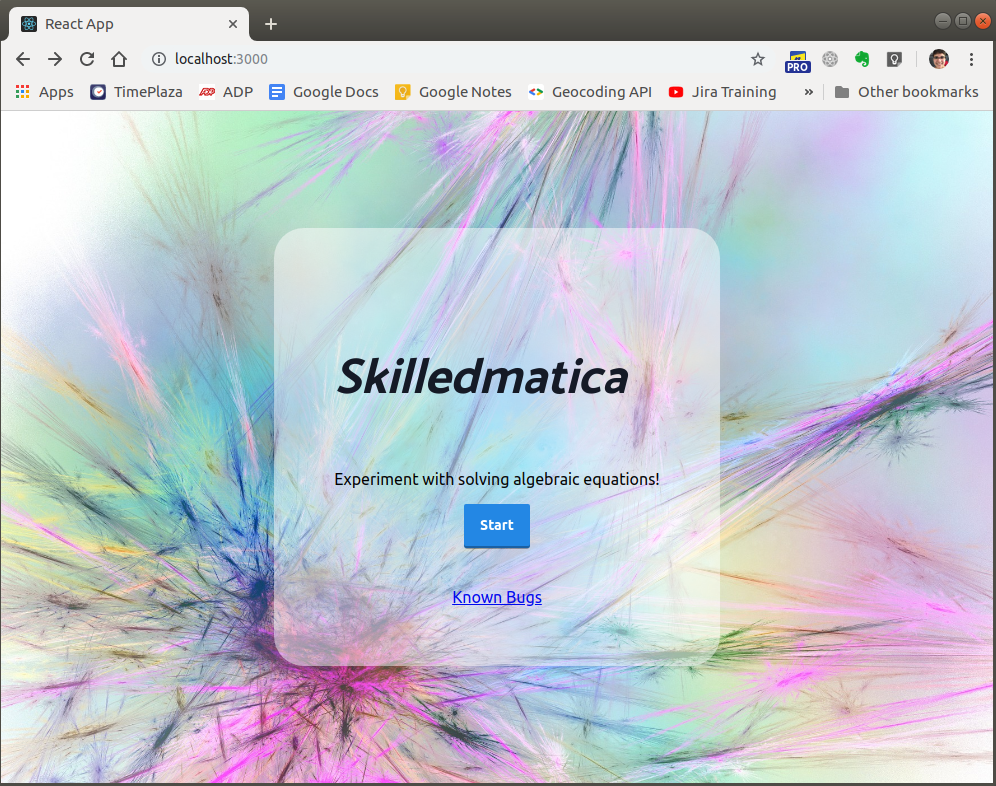
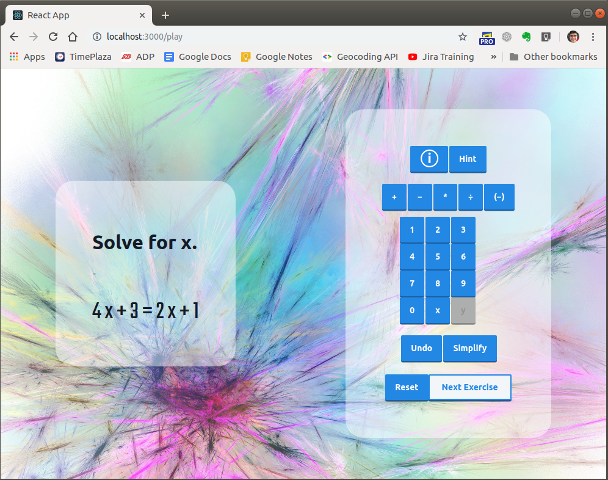
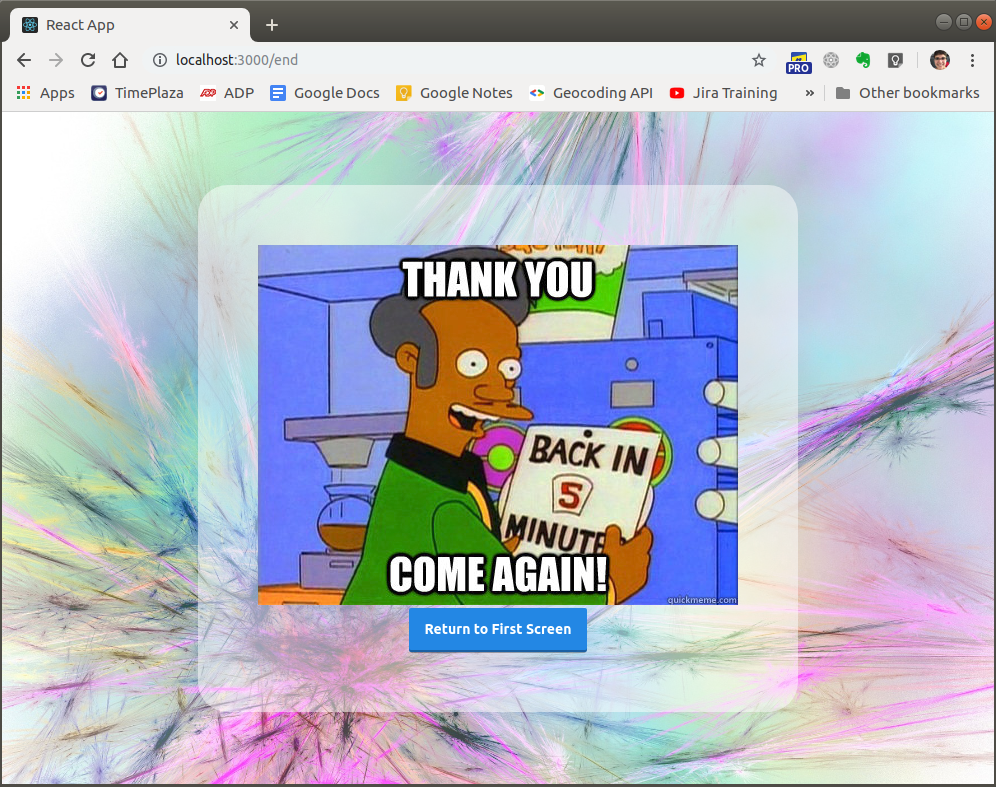

# Skilledmatica

<h2>View website here: https://meramos.github.io/parallax-site/</h2>
Tutorial followed in order to host React App on GitHub: https://levelup.gitconnected.com/deploying-a-create-react-app-with-routing-to-github-pages-f386b6ce84c2

Education got hacked! Interactive game for students to learn how to solve algebraic equations.

Set-up:

1. Install [git](https://www.linode.com/docs/development/version-control/how-to-install-git-on-linux-mac-and-windows/)
2. Clone repository by running `git clone https://github.com/meramos/Skilledmatica.git`
3. Install [npm](https://docs.npmjs.com/downloading-and-installing-node-js-and-npm) or [yarn](https://yarnpkg.com/lang/en/docs/install/#debian-stable).
4. Run `npm install` or `yarn install`
5. Run `npm start`. The application will open in your default web browser, and it will have the URL http://localhost:3000/.

Screenshots:

